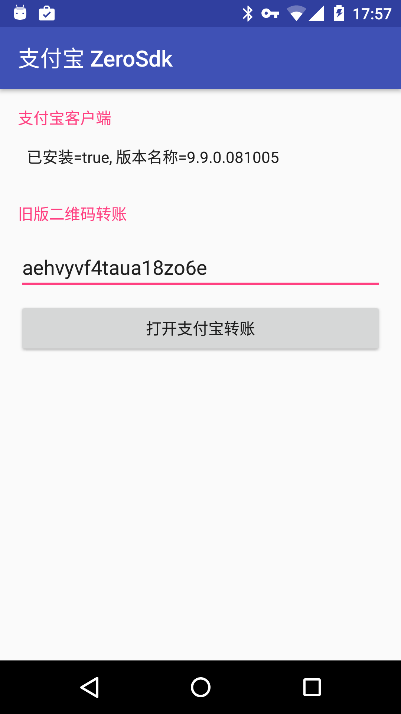

# Alipay ZeroSdk

> 一个第三方轻量支付宝转账工具类

---

### 这个能做什么？

可以在应用中直接跳转到支付宝转账的界面，比复制粘贴支付宝账号更加优雅、安全。
然而它的功能就是直接跳转到转账界面，不会获得支付结果。


### 为什么我做这个？

支付宝的接口基本都是对企业用户开放的，对于只想做一个捐赠入口的个人独立开发者来说没必要去弄这么多东西。


### 怎么用？

你需要准备一个二维码，详细方法请阅读我的博客 [**http://blog.feng.moe/2016/08/29/alipay-zerosdk/**](http://blog.feng.moe/2016/08/29/alipay-zerosdk/)

从二维码中获取到所需的参数（一串英文数字混合的字符）后，我们来开始引入这个库

在 Gradle 中配置依赖：

    allprojects {
        repositories {
            jcenter()
            maven {
                url "https://jitpack.io"
                }
            }
    }

    dependencies {
        compile 'moe.feng:AlipayZeroSdk:1.0'
    }

AlipayZeroSdk 只有一个类，我们在开始使用转账界面跳转之前，最好检测一下用户是否安装支付宝客户端，以便作出不同的应对方式：

`AlipayZeroSdk.hasInstalledAlipayClient(Context)`


确认返回结果为 true 后，我们就可以跳转到转账界面了，这时候就需要从二维码获取到的参数：

`AlipayZeroSdk.startAlipayClient(Context, String 从二维码获取到的参数)`


之后就能看到转账界面跳出了，除了这些功能你还可以查询支付宝应用的版本号（并没有什么用就是了……）


### Demo

<a href="./art/screenshot.png"></a>


你可以从 [Github Releases](https://github.com/fython/AlipayZeroSdk/releases) 下载到 Demo 的安装包

### 联系我

新浪微博：[@FungGo](http://weibo.com/fython)

Email：fython#163.com

Telegram：@fython


乐意的话可以支持一下我→ 支付宝：316643843#qq.com

### License

```
Copyright 2016 Fung Go (fython)

Licensed under the Apache License, Version 2.0 (the "License");
you may not use this file except in compliance with the License.
You may obtain a copy of the License at

    http://www.apache.org/licenses/LICENSE-2.0 
    
Unless required by applicable law or agreed to in writing, software
distributed under the License is distributed on an "AS IS" BASIS,
WITHOUT WARRANTIES OR CONDITIONS OF ANY KIND, either express or implied.
See the License for the specific language governing permissions and
limitations under the License. 
```